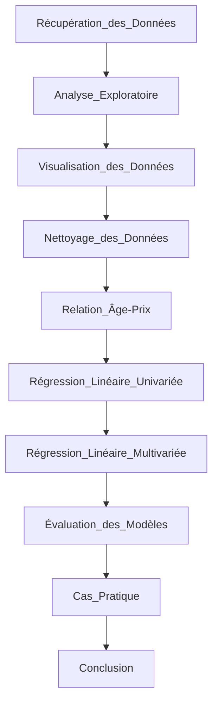

# new-car

## Contexte du projet

Le but du projet, en quelques mots, consiste à prédire le prix de sa future voiture.   
À partir d'un jeu de données récupéré depuis le site web de voiture CarDehko, ce jeu de données contient des informations sur une grande variété de véhicules (prix, kms, ...) , l'idée est d'exploiter ces données afin de déterminer le prix exact d'un véhicule spécifique.
Mais comment faire ?   
Pour cela nous utiliserons une méthode d'apprentissage automatique, la régression linéaire.   
La régression linéaire est une méthode permettant de découvrir la relation entre deux variables de l’ensemble de données, telles que le prix de la voiture et l'année de fabrication.   

Avec pour but de répondre à la requête de Martin :    
Martin souhaite acheter un véhicule ayant moins de 7 ans, pas plus de 100 000 km, avec une boite manuelle. Aidez Martin à estimer le prix d’une voiture avec ces caractéristiques.

## Contenu :
- un notebook Python `EDA.ipynb` dans lequel se trouve :
    - l'analyse exploratoire du jeu de données qui nous a été fournis dans le cadre de ce projet
    - la modélisation de ces données (data visualisation + prédiction du prix des voitures)

- bonus (à mettre à jour)

## Mise en oeuvre du projet:

## Analyse des données

## Algorithme utilisé

## Conclusion